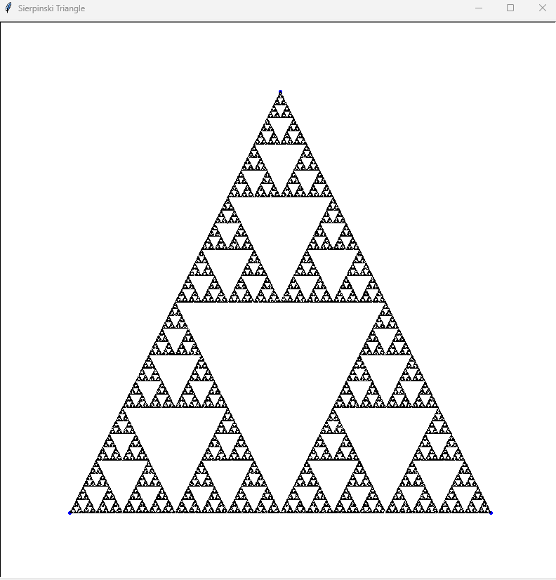

# Sierpinski Triangle

Python visualization of Sierpinski Triangle using Chaos Game algorithm.

## How to run
python sierpinski.py

> Note: After running the program, wait about 30 seconds for the triangle to fully render.

## How it works
Places 3 points (triangle vertices), then randomly selects one vertex
and moves halfway toward it. Repeating this process thousands of times
reveals the Sierpinski Triangle fractal pattern.

## Example

